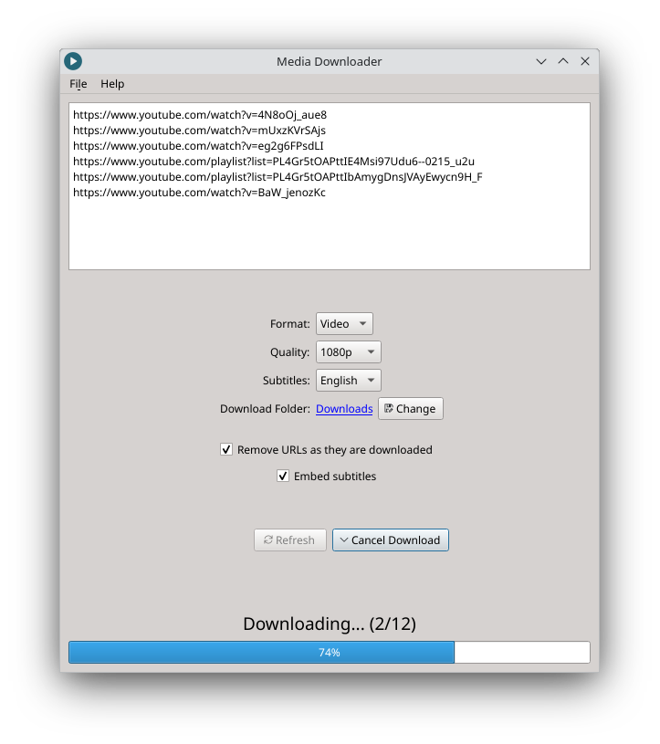

# Media Downloader
Web video/audio downloader
  
A simple qt6 frontend for [yt-dlp](https://github.com/yt-dlp/yt-dlp) written in Python using PySide6.
- Supports [hundreds of websites](https://github.com/yt-dlp/yt-dlp/blob/master/supportedsites.md)
- Supports downloading mp3 and mp4
- Supports downloading & embedding subtitles
- Allows you to work with multiple URLs at once
- Automatically embeds video chapters, thumbnails & metadata
- Quickly download media anywhere - standalone executable
## Installation
 
  
## Dependencies
Apart from a few Python packages, listed in [requirements.txt](./requirements.txt), only [ffmpeg](https://ffmpeg.org) is required.
## Goals Of This Project
This project aims to create a program that:
- automates things that would have to be done manually on other similar frontends
- only has the most used features
- has a powerful yet simple and streamlined user interface
- is lightweight and has a small amount of dependencies
## Contributing
Contributions are very appreciated, but before contributing, please read the 
'Goals Of This Project' section to understand what contributions might get rejected.
## License
All versions above 3.1.0 are licensed under [GPL version 3 or later](https://www.gnu.org/licenses/gpl-3.0.html). All versions below 3.1.0 are closed source and are not available in this repository.
## Additional Information
### Theming
The program uses the QT's Fusion theme. This setting is hard-coded, so the program does not respond to themes set globally in a system (apart from responding to light/dark theme).
### Translations
There is currently no interest in translating this program to other languages. Also, the current code is not written in a way that supports translating.
### Update Mechanism
This program currently has no update mechanism. However, there are plans to add it in a future version.
## Disclaimer
The creator of Media Downloader is not responsible/liable for any misuse of this program that may violate local copyright/DMCA laws. Users use this application at their own risk.
