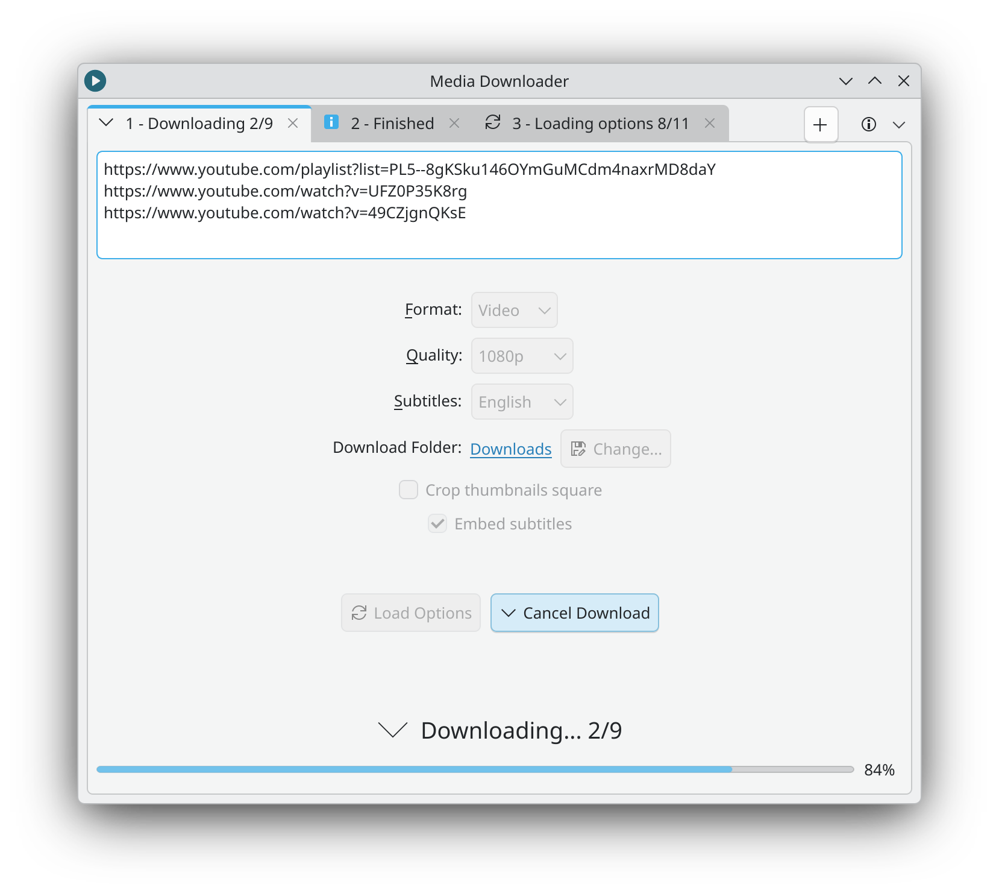

<div align="center">
  <h1>
       &nbsp;Media Downloader
  </h1>
  <p>
    Web video/audio downloader &nbsp;·&nbsp; <a href="https://downloader.markopejic.com/">downloader.markopejic.com</a>
  </p>
  <p>
    <a href="https://flathub.org/apps/com.markopejic.downloader"></a>
    &nbsp; &nbsp;
    <a href="https://github.com/markop404/media-downloader/releases/latest"></a>
  </p>
  
  <br>
</div>

## About

A simple Qt frontend for [yt-dlp](https://github.com/yt-dlp/yt-dlp) written in Python.

- Supports [hundreds of websites](https://github.com/yt-dlp/yt-dlp/blob/master/supportedsites.md)
- Supports downloading mp3 and mp4
- Supports downloading & embedding subtitles
- Allows you to download and work with multiple URLs at once
- Automatically embeds video chapters, thumbnails & metadata
- Supports cropping thumbnails / album arts to square shape (useful when downloading music)

## Status

Development in this repository is currently **limited to maintenance and bug fixes only**. When I will have the time, I will do a complete rewrite of the app and implement some of the missing features / ideas I have.

## Support

The easiest way to support this project is to star it on GitHub. You can also support the developer by making a [donation](https://downloader.markopejic.com/donate).

## Goals

This project aims to create an application that:

- automates things that would have to be done manually on other similar frontends
- only has the most used features
- has a powerful yet simple and streamlined user interface
- is lightweight and has a small amount of dependencies

## Contributing

Any contributions are highly appreciated as long as they follow the project's goals.

## Planned features

- Settings menu with more customization options
- Installer & automatic updates on Windows
- Remember previously used settings
- Support for macOS

## Running from source on macOS

> [!NOTE]
> macOS will be supported in the future, at which point the instructions will be removed.

> [!IMPORTANT]
> The instructions below assume you have brew installed. If not, go to [brew.sh](https://brew.sh/) and install it.

1. Install Python:

```bash
brew install python
```

2. Install FFmpeg:

```bash
brew install ffmpeg
```

3. Clone this repo:

```bash
git clone https://github.com/markop404/media-downloader/ && cd media-downloader
```

4. Install pip dependencies:

```bash
pip3 install -r requirements.txt
```

5. Run the app:

```bash
python3 main.py
```

## License

All versions above (including) 3.1.0 are licensed under [GPL version 3 or later](https://www.gnu.org/licenses/gpl-3.0.html). All versions below 3.1.0 are closed source and are not available in this repository.

## Disclaimer

Videos on YouTube and other sites may be subject to DMCA protection. The authors of Media Downloader do not endorse, and are not responsible for, the use of this application in means that will violate these laws.
